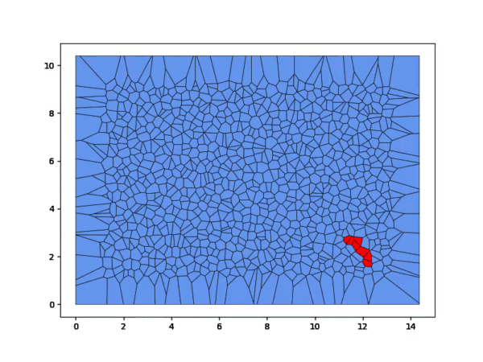

# A few representations of epidemiology-like processes

Right below you see a quick and dirty showcase of some simulation results in time domain. Of course, I have skipped a lot of steps of how I got to this. Things to come will complete the information about what is being done.

Appealing? Let's dive into what we are doing.

## Introduction

First off, we are dealing with so-called compartmented models. They can be a series of groups governed by a set of differential equations or a set of chemical reactions or events happening within a given domain.

The first case responds to the deterministic representation of such process as an epidemic as described in the early papers of Kermack and McKendrick at the end of 1920s.
The latter is a stockastic representation of a chain of reactions. The approach here is a Gillespie discretisation.

## Deterministic models

The deterministic model in its simplest form and without integro-differential terms (CITATION) can be summed up as

=-\beta\frac{S(t)I(t)}{N})

a

=+\beta\frac{S(t)I(t)}{N}-\alphaI(t))

b

=+\alphaI(t))

`S` is the group of susceptible individuals (not yet infected); `I` those infected (and infectious!); finally, `R` stands for the removed group, be that by healing or death. There are two ratios: $\beta$ and $\alpha$. The first one reflects the rate at which an sn exposed subject becomes infected; the latter is the rate at which the infected people become removed. Finally, the transition from group to group are normalised by `N`, the population volume.

 

This is seen easily in the Python file `Model01.py`.

## Stockastic models (Gillespie)

No matter what model variation we choose (SEIR, SEIRVD, SES...) each simulation with the same parameters will yield the same results. This is overcome with a probability approach in deciding wichi reaction (see event) will happen next and at what time. In other words, whether an infection or a removal will happen, at which node and what node has the smallest waiting time based on on a probability distribution.

### Simple case

The steps followed 
Create a network
Set N nodes
Infect one node (somewhere in the network)
Draw events and advance time

#### (Simple case) Details

Compute the node's propentity
Compute the Poisson sequences for each node
Draw the mowest waiting time

### Involved case: domain tessellation

The nodes may be distributed homogeneously, regularly, arbitrarily (this is framed within the context of Random-Sequential-Adsorption [RSA](https://en.wikipedia.org/wiki/Random_sequential_adsorption), hyper/uniformity, etc. to be discussed later CITATIONS: Torquato, Hinrichsen, Norris, Connoir, Rohfritsch). One may want to draw polygons around the nodes and treach each one as the baricenter of a Voronoi cell. Now we have two new criteria between neighbors: the node-to-node distance and the length of the shared fae between two cells.

#### (Involved case) The degree `k` of the network's nodes

The degree distribution:

The approximations of the degree distribution:

Applications and moments of `k`:

### Further investigations

1) How is the spectrum of the adjacency matrix of the laplacian of the adjancency matrix of the network related to epidemiological parameters such as the time to reach maximum infection?
2) Does the spectral gap relate to the global cumulative propensity ?
3) What are best representations of a town/city spatial network? Completely mixed? Random? Albert-Barabasi?
4) Once the best suited network is identified, what parameters are more informative (in terms of robustness) to inform about the propagation in case of node removal (a.k.a. attack)
5) If we forget the third group of the representation and focus on the infection as a binary operation, how close does the simulation estimate a cascaded failure, with application in, say, a banking network. How is the network's robustness characterised?

